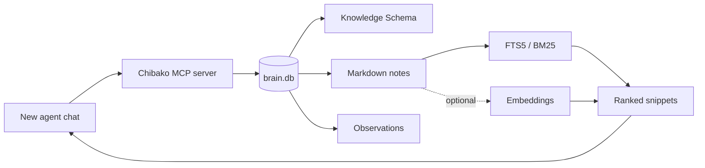
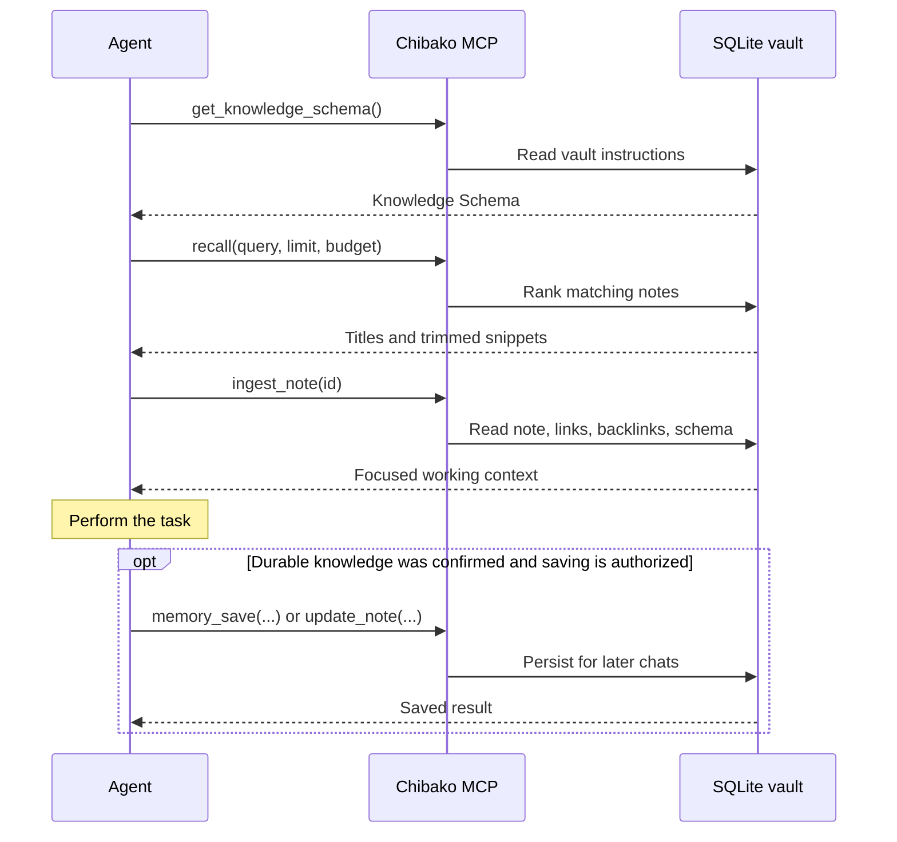
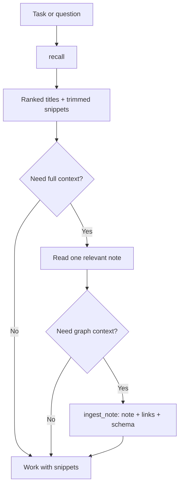

# Agent memory in Chibako

Chibako gives AI agents durable, shared memory without putting the whole vault
into every prompt. Notes remain human-readable Markdown, while MCP provides a
small retrieval path: discover first, load only what the task needs, then save
confirmed knowledge when authorized.

## How it works

The chat itself is not copied into Chibako. Memory becomes reusable only when
an agent or person saves a note or observation. A later chat can access it when
its MCP connection points to the same `brain.db` vault.

The three stored forms have different jobs:

| Stored data | Purpose | How an agent reads it |
|---|---|---|
| Knowledge Schema | Vault-specific rules for naming, linking, properties, and compilation | `get_knowledge_schema` or `ingest_note` |
| Notes | Canonical, substantial knowledge in Markdown | `recall`, `search_notes`, `read_note`, `ingest_note` |
| Observations | Short decisions, preferences, and lessons | `list_observations` |

## A typical session

The installable [`chibako-memory`](../skills/chibako-memory/SKILL.md) skill
teaches compatible agents this workflow. The skill still requires a configured
Chibako MCP connection. Installation makes the workflow discoverable; persistent
agent instructions can require it at the beginning of every task.

## Why retrieval uses fewer context tokens

Chibako uses progressive disclosure. An agent can move from a small index to a
bounded set of snippets and read a full note only after finding a relevant one.

Evidence in the implementation:

- [`list_notes`](../src/mcp/server.ts#L89) returns note metadata instead of
  note bodies. [`get_links`](../src/mcp/server.ts#L194) returns compact link
  targets and backlink identities.
- [`recall`](../src/lib/recall.ts#L107) always ranks candidates with SQLite
  full-text search and returns titles plus trimmed snippets. If embeddings are
  configured, it fuses vector and keyword rankings; otherwise it stays local
  and uses BM25 alone.
- The caller supplies a retrieval budget. Chibako estimates token use from
  character count and stops adding results near that budget
  ([implementation](../src/lib/recall.ts#L140),
  [test](../tests/recall.test.ts#L7)).
- [`ingest_note`](../src/mcp/server.ts#L311) combines a note, its outlinks,
  backlinks, and the Knowledge Schema in one MCP call. This saves round trips;
  its full note body can still be large.

The token budget is approximate. Chibako currently estimates tokens with
`characters / 4`, trims snippets by words, and may return the first result even
when it exceeds the requested budget. Claims such as “exact token cap” or a
specific percentage saved would require tokenizer-based measurements and a
repeatable benchmark. The supported claim is: **Chibako lets callers target a
context budget and avoids loading full note bodies during discovery.**

## Where Chibako differs

Chibako combines a human-owned note vault with an agent retrieval interface.
That makes its tradeoffs different from dedicated memory platforms and from
desktop note applications.

| Approach | Typical memory model | Chibako difference |
|---|---|---|
| Dedicated agent memory, such as Mem0 | Extracted memories searched through semantic retrieval and filters | Canonical knowledge stays directly editable as Markdown; keyword retrieval works without an LLM, embeddings service, or vector database |
| Persistent agent runtime, such as Letta | Memory blocks can remain in the agent's context | Chibako retrieves vault content on demand, so unrelated notes do not need to occupy every prompt |
| Local note apps, such as Obsidian or Logseq | Human-first local vault or graph, with agent access added through integrations | Chibako ships a self-hosted web UI, scoped REST API, and MCP server against the same server-side vault |

This is not a universal performance ranking. Mem0 provides richer memory
extraction and filtering, Letta provides an agent runtime with persistent
in-context memory, and established note apps have larger ecosystems. Chibako's
advantage is the combination of inspectable Markdown, explicit wikilinks,
self-hosted storage, scoped agent access, and budget-targeted retrieval.

Primary references:

- [Model Context Protocol tools specification](https://modelcontextprotocol.io/specification/2025-06-18/server/tools)
- [Mem0 memory search](https://docs.mem0.ai/core-concepts/memory-operations/search)
- [Mem0 open-source repository](https://github.com/mem0ai/mem0)
- [Letta memory documentation](https://docs.letta.com/guides/agents/memory/)
- [Obsidian help](https://help.obsidian.md/)
- [Logseq documentation](https://docs.logseq.com/)

## Access and ownership

Chibako stores notes, links, settings, observations, search data, and optional
embeddings in one SQLite vault. API keys are hashed, revocable, and scoped. A
read-only agent can receive `notes:read`, `search:read`, and `schema:read`; add
`notes:write` only when that agent should save knowledge.

MCP is a local stdio transport in the current release. The MCP process reads
the same data directory as the web application, so both surfaces must be
configured with the same `CHIBAKO_DATA_DIR`. See [Connect your AI
agent](../README.md#-connect-your-ai-agent) for configuration.

## Current limits

- Chibako does not automatically capture chat transcripts.
- `recall` searches notes; observations are retrieved separately and currently
  have no query filter.
- Token budgeting is estimated rather than tokenizer-enforced.
- Semantic recall needs an OpenAI-compatible embedding provider; keyword recall
  works without one.
- Chibako has no published cross-product token benchmark yet.

